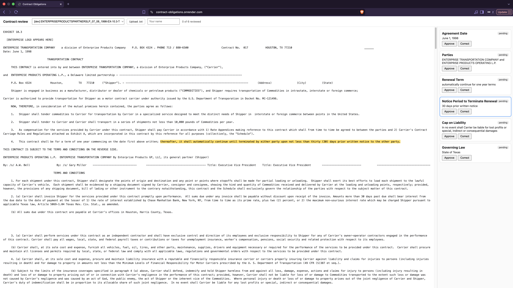
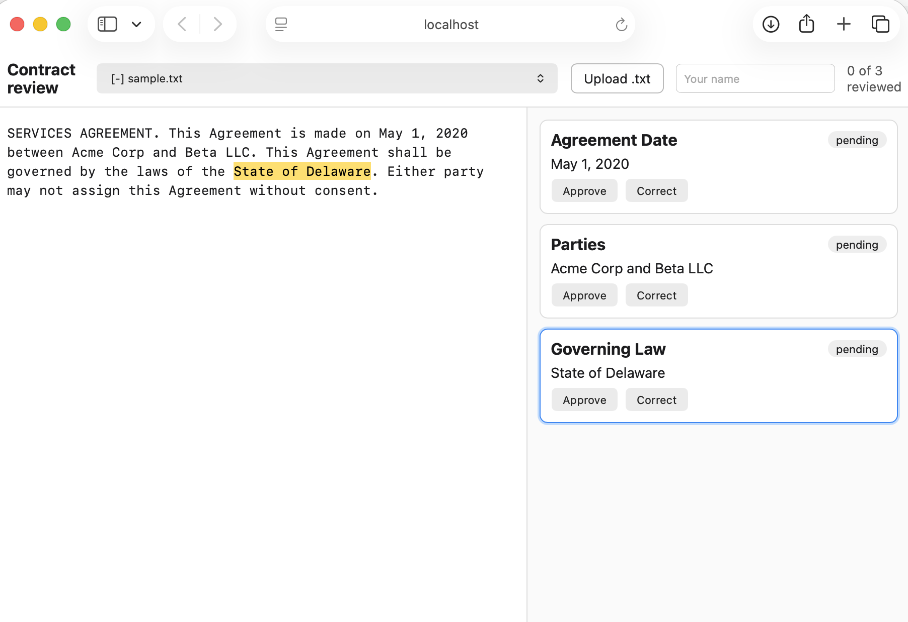

# Contract Obligations

Reads a contract, pulls out 8 key fields (parties, dates, renewal terms, governing law, liability cap) and keeps the exact clause each one came from. A person approves or corrects every field, and every review is logged. An evaluation harness scores the extraction against expert labels.

**Live demo:** https://contract-obligations.onrender.com
Free hosting: the first load after idle can take about a minute. Uploads are turned off on the public demo (see "What failed"); they work when you run it locally.



## What it does

1. Upload a contract as plain text.
2. See the extracted fields. Click one and the clause it came from is highlighted in the contract.
3. Approve it or correct it. Who did it and when is saved, with the old and new value.
4. Look up reviewed fields across contracts, for example `GET /api/obligations?field=Governing%20Law&q=delaware`. Only approved or corrected fields are returned.

## Upload (runs locally)

Click **Upload .txt**, pick a plain-text contract, and the app extracts the fields and opens it for review. Uploading the same text again opens the existing contract and makes no new model call. Uploads are turned off on the public demo, so this screenshot is from a local run (a made-up two-sentence contract):



## Results

Data: [CUAD](https://github.com/TheAtticusProject/cuad) (510 commercial contracts with expert labels, CC BY 4.0), 8 fields. I used 50 contracts to develop the prompt and 50 different contracts as a held-out test, both chosen by a hash of the contract title. The held-out set was run once with the final prompt, plus once with the first prompt for comparison. Nothing was changed after seeing those numbers. Model: `gemini-3.5-flash-lite`.

Held-out set (50 contracts the prompt was never tuned on):

| Field | Labeled | Precision | Recall | F1 (v3) | F1 (v1) | Clause overlap (v3) |
|---|---|---|---|---|---|---|
| Parties | 50 | 100.0 | 90.0 | 94.7 | 96.9 | 93.3 |
| Agreement Date | 47 | 100.0 | 87.2 | 93.2 | 94.4 | 82.9 |
| Effective Date | 34 | 82.5 | 97.1 | 89.2 | 88.0 | 93.9 |
| Expiration Date | 42 | 95.8 | 54.8 | 69.7 | 69.7 | 100.0 |
| Renewal Term | 15 | 77.8 | 93.3 | 84.8 | 90.9 | 100.0 |
| Notice Period to Terminate Renewal | 8 | 58.3 | 87.5 | 70.0 | 43.8 | 100.0 |
| Governing Law | 43 | 97.6 | 95.3 | 96.5 | 96.5 | 100.0 |
| Cap on Liability | 24 | 90.0 | 75.0 | 81.8 | 54.5 | 88.9 |
| **Micro F1 / Macro F1** | | | | **87.9 / 85.0** | 85.1 / 79.3 | |

- **Cost per contract: $0.0045** at Google's published list price ($0.30 per 1M input tokens, $2.50 per 1M output tokens), averaging 10.8k input tokens. I ran everything on the free tier, so I paid $0.
- **Latency:** about 2.6 seconds per contract.
- **How to read it:** a field counts as found if the model returned a clause that exists in the contract text. Precision and recall measure found versus labeled. "Clause overlap" is the share of found fields whose clause overlaps an expert-marked span.
- Fields with few labeled contracts are noisy. Notice Period rests on 8 contracts, so one contract moves it by about 12 points.

## Prompt experiment

I read the misses on the dev set, changed the wording of two fields, and re-ran the same 50 contracts.

| Version | Change | Micro F1 | Macro F1 | Cap on Liability F1 | Notice Period F1 |
|---|---|---|---|---|---|
| v1 | field descriptions as written | 88.3 | 83.8 | 68.4 | 54.5 |
| v2 | used CUAD's wording for Cap on Liability (limits on liability, not just dollar caps); asked to exclude breach and convenience notices | 88.4 | 84.4 | 84.0 | 51.6 |
| v3 | Notice Period: fill it only if the contract renews or extends and states notice to stop that | 88.9 | 86.0 | 88.5 | 66.7 |

v2's exclusion rule did not work (the model ignored it). v3 rewrote it as a positive rule. On the held-out set, v3 beats v1 by 2.8 points micro and 5.7 points macro.

## Design rules

- **Every field keeps its source clause.** The model returns the exact clause text; the code finds the real character offsets in the contract. If the text cannot be found, the field is not saved.
- **Processing is idempotent.** The same contract text (SHA-256 content hash) is never sent to the LLM twice.
- **Nothing is final until a person approves it.** Reviews are an audit trail: reviewer, action, old value, new value, timestamp.
- **Every LLM call is logged** with tokens, cost and latency.
- **Fallbacks:** invalid JSON is rejected with zod; temporary errors (429, 5xx) are retried; a regex fallback covers dates and governing law.
- Database rows cannot be deleted while something references them, so the audit trail stays intact.

## Stack

TypeScript, Node 22, Express, Prisma 7, PostgreSQL 16, React + Vite, zod, Vitest (53 tests), GitHub Actions CI, Docker Compose (local database). Hosted on Render (app) and Neon (database). Model: Gemini API.

## Run it locally

You need Node 22, Docker, and a free Gemini API key from https://aistudio.google.com/apikey.

```bash
nvm use
npm ci
cp .env.example .env                      # then put your key in GEMINI_API_KEY
docker compose up -d                      # PostgreSQL on port 5544
npx prisma generate
npx prisma migrate deploy
mkdir -p data/cuad
curl -L -o data/cuad/data.zip https://github.com/The-Atticus-Project/cuad/raw/main/data.zip
(cd data/cuad && unzip -o data.zip)
npm run cuad:load                         # 100 contracts and their expert labels
npm run extract:batch -- --prompt=v3      # extract the 50 dev contracts
npm run eval -- --prompt=v3               # prints the report
npm test
npm run dev                               # API on :3000
(cd web && npm ci && npm run dev)         # screen on :5173
```

Held-out test (run once): `npm run extract:batch -- --split=heldout --final --prompt=v3` then `npm run eval -- --split=heldout --final --prompt=v3`. Reports from my runs are in `docs/eval/`.

Set `DEMO_MODE=true` to turn off uploads and retries (used on the public demo).

## What failed

- **Expiration Date recall is 55%** on the held-out set, and I did not fix it. I stopped tuning to avoid fitting the dev set.
- **Notice Period is only 8 labeled contracts.** The improvement from 43.8 to 70.0 is real but noisy.
- **Parties spans look low on strict overlap** (about 14% IoU) because the model returns the whole opening sentence while experts mark each name. Clause overlap (93%) is the fairer number for this field.
- **20 fields across the 50 held-out contracts were dropped** because the clause the model returned could not be found exactly in the text. They count as misses. The regex fallback only covers three fields and is not part of the scores.
- **No "contracts that renew in 90 days" lookup.** Values are clause text, not normalized dates, so the lookup filters reviewed fields by name and text.
- **Upload is plain text only.** No PDF support.
- **No login.** The reviewer is a typed name, and on the public demo anyone can review. Uploads are off there on purpose: they would send text to a free-tier AI service whose data may be used to improve Google's products, and strangers could use up the quota. I only used public contracts, and a real deployment would use the paid tier.
- **Hosting is free-tier:** the demo sleeps after idle and takes about a minute to wake. I did not use AWS: the current AWS free plan closes the account after 6 months, which would take the live link down.
- **No tests for the React screen**, and no end-to-end tests. The API, extraction, eval metrics and idempotency are covered.
- **Security audit:** `npm audit` flagged two libraries bundled inside the Prisma CLI. There was no patched Prisma 7 release, so I pinned patched versions with `overrides` in `package.json`. Remove them once Prisma ships a fix.

## Data and license

Contract Understanding Atticus Dataset (CUAD), The Atticus Project, CC BY 4.0: https://github.com/TheAtticusProject/cuad
